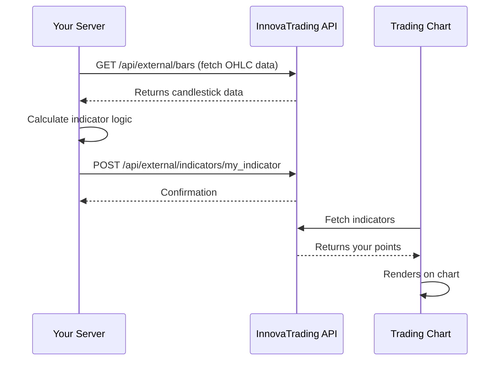

## What are External Indicators?

External Indicators allow developers to **create custom trading signals** that display directly on InnovaTrading charts.

Instead of building indicators inside the platform, you:
1. Fetch market data from our API
2. Run your calculations on your own server
3. Send the results back to be displayed

This gives you complete freedom to use any programming language, library, or trading strategy.

## How It Works



## Indicator Structure

Each indicator consists of:

| Component | Description |
|-----------|-------------|
| **indicator_id** | Unique identifier (e.g., `smart_money_v2`) |
| **indicator_name** | Display name in the UI |
| **symbol** | Trading pair (e.g., `EURUSD`) |
| **timeframe** | Chart timeframe in minutes |
| **points** | Array of visual markers on the chart |
| **metadata** | Optional analytics data |

## Points vs Signals

- **Point**: A single visual marker (Entry, SL, TP1, etc.)
- **Signal**: A complete trade setup (multiple related points)

A BUY signal typically contains 4-5 points:
- 1 Entry point
- 1 Stop Loss
- 2-3 Take Profits

## Indicator Lifecycle

### 1. Creation
```
POST /api/external/indicators/{indicator_id}
```
Submit your indicator with all points.

### 2. Storage
Data is stored temporarily (24 hours) associated with your API key.

### 3. Display
The chart fetches and renders your indicator automatically.

### 4. Update
Re-submit to update. New data replaces old data.

### 5. Expiration
After 24 hours, data is automatically cleaned up.

<Warning>
  Indicators expire after 24 hours. Set up a cron job to re-submit periodically.
</Warning>

## Access Control

Each API key has specific permissions:

| Permission | Description |
|------------|-------------|
| `symbols` | Which trading pairs you can access |
| `timeframes` | Which timeframes you can use |
| `rate_limit` | How many requests per hour |

<Note>
  Contact us to request access to additional symbols or higher rate limits.
</Note>

## Best Use Cases

<CardGroup cols={2}>
  <Card title="Custom Strategies" icon="chart-line">
    Implement proprietary trading strategies that aren't built into the platform.
  </Card>
  <Card title="Machine Learning" icon="brain">
    Use Python ML libraries to generate signals from trained models.
  </Card>
  <Card title="Multi-Timeframe Analysis" icon="clock">
    Combine signals from multiple timeframes into a single indicator.
  </Card>
  <Card title="External Data" icon="database">
    Incorporate sentiment, news, or other external data sources.
  </Card>
</CardGroup>

## Limitations

- **24-hour expiration**: Data must be re-submitted daily
- **No real-time streaming**: Use polling to update (every 5-15 minutes)
- **Rate limits apply**: Respect the limits to avoid throttling
- **Symbol restrictions**: Only access symbols assigned to your API key

## Next Steps

<CardGroup cols={2}>
  <Card title="Quick Start" icon="rocket" href="/quickstart">
    Build your first indicator in 5 minutes
  </Card>
  <Card title="Signal Format" icon="circle-dot" href="/concepts/signals">
    Learn the exact format for trading signals
  </Card>
</CardGroup>
