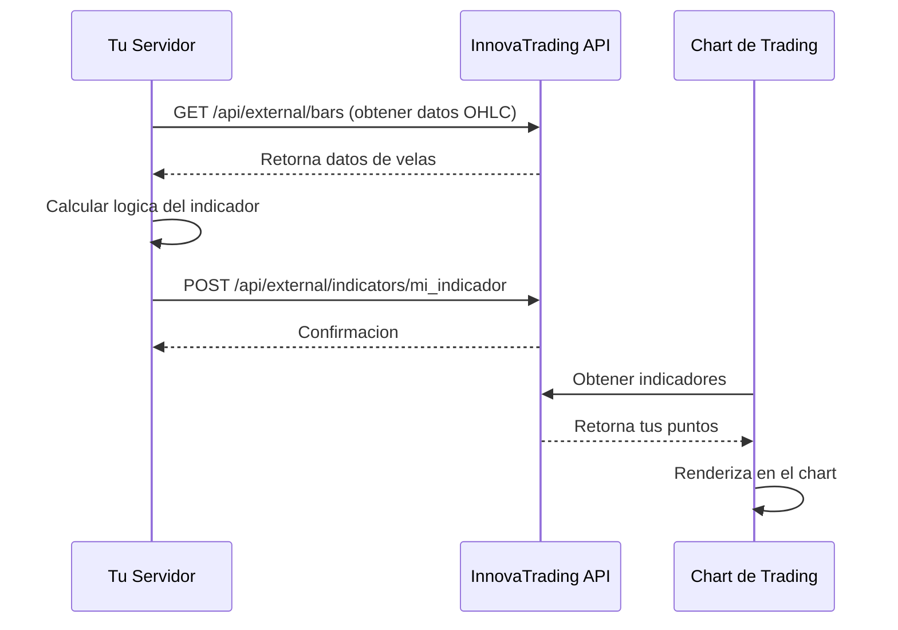

## Que son los Indicadores Externos?

Los Indicadores Externos permiten a desarrolladores **crear senales de trading personalizadas** que se muestran directamente en los charts de InnovaTrading.

En lugar de construir indicadores dentro de la plataforma, tu:
1. Obtienes datos de mercado de nuestra API
2. Ejecutas tus calculos en tu propio servidor
3. Envias los resultados para que se muestren

Esto te da total libertad para usar cualquier lenguaje de programacion, libreria o estrategia de trading.

## Como Funciona



## Estructura del Indicador

Cada indicador consiste de:

| Componente | Descripcion |
|------------|-------------|
| **indicator_id** | Identificador unico (ej: `smart_money_v2`) |
| **indicator_name** | Nombre que se muestra en la UI |
| **symbol** | Par de trading (ej: `EURUSD`) |
| **timeframe** | Timeframe del chart en minutos |
| **points** | Array de marcadores visuales en el chart |
| **metadata** | Datos opcionales de analytics |

## Puntos vs Senales

- **Punto**: Un solo marcador visual (Entrada, SL, TP1, etc.)
- **Senal**: Una configuracion de trade completa (multiples puntos relacionados)

Una senal de COMPRA tipicamente contiene 4-5 puntos:
- 1 punto de Entrada
- 1 Stop Loss
- 2-3 Take Profits

## Ciclo de Vida del Indicador

### 1. Creacion
```
POST /api/external/indicators/{indicator_id}
```
Envias tu indicador con todos los puntos.

### 2. Almacenamiento
Los datos se guardan temporalmente (24 horas) asociados a tu API key.

### 3. Visualizacion
El chart obtiene y renderiza tu indicador automaticamente.

### 4. Actualizacion
Re-enviar para actualizar. Los datos nuevos reemplazan los anteriores.

### 5. Expiracion
Despues de 24 horas, los datos se limpian automaticamente.

<Warning>
  Los indicadores expiran despues de 24 horas. Configura un cron job para re-enviar periodicamente.
</Warning>

## Control de Acceso

Cada API key tiene permisos especificos:

| Permiso | Descripcion |
|---------|-------------|
| `symbols` | Pares de trading a los que puedes acceder |
| `timeframes` | Timeframes que puedes usar |
| `rate_limit` | Cuantas solicitudes por hora |

<Note>
  Contactanos para solicitar acceso a simbolos adicionales o limites mas altos.
</Note>

## Mejores Casos de Uso

<CardGroup cols={2}>
  <Card title="Estrategias Personalizadas" icon="chart-line">
    Implementa estrategias de trading propietarias que no estan integradas en la plataforma.
  </Card>
  <Card title="Machine Learning" icon="brain">
    Usa librerias de ML de Python para generar senales desde modelos entrenados.
  </Card>
  <Card title="Analisis Multi-Timeframe" icon="clock">
    Combina senales de multiples timeframes en un solo indicador.
  </Card>
  <Card title="Datos Externos" icon="database">
    Incorpora sentimiento, noticias u otras fuentes de datos externas.
  </Card>
</CardGroup>

## Limitaciones

- **Expiracion de 24 horas**: Los datos deben re-enviarse diariamente
- **Sin streaming en tiempo real**: Usa polling para actualizar (cada 5-15 minutos)
- **Aplican limites de tasa**: Respeta los limites para evitar throttling
- **Restricciones de simbolos**: Solo accede a simbolos asignados a tu API key

## Siguientes Pasos

<CardGroup cols={2}>
  <Card title="Inicio Rapido" icon="rocket" href="/es/quickstart">
    Construye tu primer indicador en 5 minutos
  </Card>
  <Card title="Formato de Senales" icon="circle-dot" href="/es/concepts/signals">
    Aprende el formato exacto para senales de trading
  </Card>
</CardGroup>
