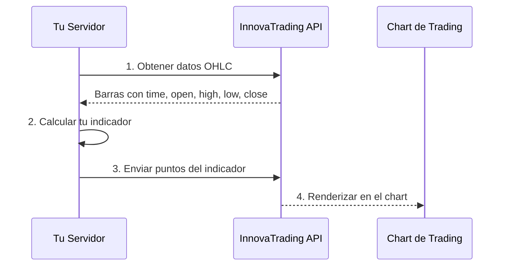

## Descripcion General

La API de InnovaTrading permite a desarrolladores externos crear **indicadores personalizados** que se renderizan directamente en nuestros charts de trading.

<CardGroup cols={2}>
  <Card title="Inicio Rapido" icon="rocket" href="/es/quickstart">
    Crea tu primer indicador en 5 minutos
  </Card>
  <Card title="Referencia API" icon="code" href="/es/api-reference/introduction">
    Documentacion completa de endpoints
  </Card>
  <Card title="SDKs" icon="cube" href="/es/sdks/overview">
    Librerias oficiales para Python y JavaScript
  </Card>
  <Card title="Guias" icon="book" href="/es/guides/first-indicator">
    Tutoriales paso a paso
  </Card>
</CardGroup>

## Como Funciona



## Que Puedes Construir

<AccordionGroup>
  <Accordion title="Senales de Trading" icon="chart-line">
    Crea senales de compra/venta con Entry, Stop Loss y Take Profits que aparecen directamente en el chart.
  </Accordion>
  <Accordion title="Indicadores Personalizados" icon="wand-magic-sparkles">
    Construye cualquier indicador usando tu lenguaje preferido. Soportamos cualquier logica que puedas programar.
  </Accordion>
  <Accordion title="Modelos de ML" icon="brain">
    Despliega modelos de machine learning y muestra sus predicciones en tiempo real.
  </Accordion>
  <Accordion title="Alertas Multi-Timeframe" icon="clock">
    Combina analisis de multiples timeframes en un solo indicador visual.
  </Accordion>
</AccordionGroup>

## Ejemplo Rapido

```python
import requests

# 1. Obtener datos de mercado
bars = requests.get(
    "https://api.innova-trading.com/api/external/bars/EURUSD/60",
    headers={"Authorization": "Bearer TU_API_KEY"}
).json()["bars"]

# 2. Calcular tu indicador (ejemplo: ultima barra)
ultima_barra = bars[-1]

# 3. Crear senal
senal = {
    "symbol": "EURUSD",
    "timeframe": 60,
    "indicator_name": "Mi Indicador",
    "points": [
        {
            "time": ultima_barra["time"],
            "type": "low",
            "price": ultima_barra["close"],
            "label": "COMPRA",
            "color": "#3b82f6",
            "shape": "arrowUp",
            "size": 2
        }
    ]
}

# 4. Enviar a la API
requests.post(
    "https://api.innova-trading.com/api/external/indicators/mi_indicador",
    json=senal,
    headers={"Authorization": "Bearer TU_API_KEY"}
)
```

## Recursos

<CardGroup cols={3}>
  <Card title="Autenticacion" icon="key" href="/es/authentication">
    Aprende a usar tu API key
  </Card>
  <Card title="Formato de Senales" icon="circle-dot" href="/es/concepts/signals">
    Estructura de datos para senales
  </Card>
  <Card title="Mejores Practicas" icon="check" href="/es/guides/signal-best-practices">
    Tips para senales profesionales
  </Card>
</CardGroup>

## Soporte

<Note>
  Necesitas ayuda? Contactanos en Discord o abre un issue en GitHub.
</Note>
