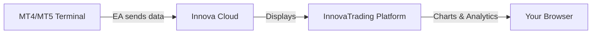

## Overview

InnovaTrading connects to your MetaTrader 4 or MetaTrader 5 terminal through an **Expert Advisor (EA)**. Once connected, you get:

- **Real-time market data** from your broker
- **Account information** (balance, equity, margin)
- **Trade history** synced automatically
- **Position tracking** updated every second
- **Multi-account support** - connect as many accounts as you want

<Frame>
  
</Frame>

## How It Works

1. **You install** the InnovaTrading EA on your MetaTrader terminal
2. **EA connects** to Innova Cloud using your personal API token
3. **Data flows** securely to your InnovaTrading dashboard
4. **You analyze** with our advanced charting tools

<Note>
  Your trading credentials never leave your terminal. The EA only reads and sends market data - it does NOT execute trades.
</Note>

## Quick Start

<Steps>
  <Step title="Generate a Token">
    Go to [Connections](/dashboard/connect) and click **+ New Connection** to generate an API token.

    [Generate Token](/dashboard/connect)
  </Step>

  <Step title="Download the EA">
    Download the Expert Advisor for your platform:

    <CardGroup cols={2}>
      <Card title="MetaTrader 5" icon="download" href="https://innova-trading.com/downloads/InnovaTrading_v5.ex5">
        Download .ex5 file
      </Card>
      <Card title="MetaTrader 4" icon="download" href="https://innova-trading.com/downloads/InnovaTrading_MT4_v1.ex4">
        Download .ex4 file
      </Card>
    </CardGroup>
  </Step>

  <Step title="Install & Configure">
    Copy the EA to your MetaTrader data folder and configure your token.

    [Full Installation Guide](/guides/install-ea)
  </Step>

  <Step title="Verify Connection">
    Check your [Connections page](/dashboard/connect) - you should see your account appear within seconds.
  </Step>
</Steps>

## Requirements

<AccordionGroup>
  <Accordion title="MetaTrader 4 or 5">
    Any MT4 or MT5 terminal from any broker works. The EA is compatible with:
    - Desktop terminals (Windows)
    - VPS installations
    - Multiple instances on the same machine
  </Accordion>

  <Accordion title="Internet Connection">
    The EA needs to reach `cloud.innova-trading.com` on port 443 (HTTPS). Most brokers allow this by default.
  </Accordion>

  <Accordion title="WebRequest Permission">
    MetaTrader must allow WebRequest to our server URL. We'll show you how to configure this in the [installation guide](/guides/install-ea).
  </Accordion>
</AccordionGroup>

## Security

<Info>
  **Your data is secure.** All communication uses HTTPS encryption. Your broker login credentials are never transmitted - only market data.
</Info>

| Data Sent | Data NOT Sent |
|-----------|---------------|
| Symbol prices | Broker password |
| Account balance/equity | Personal information |
| Open positions | Trading permissions |
| Trade history | Two-factor codes |

Each API token is:
- **Unique** to your account
- **Locked** to the first MT4/MT5 account that uses it
- **Revocable** at any time from your dashboard
- **Expiring** after 1 year (renewable)

## Next Steps

<CardGroup cols={2}>
  <Card
    title="Install the EA"
    icon="download"
    href="/guides/install-ea"
  >
    Step-by-step installation guide
  </Card>
  <Card
    title="Create Tokens"
    icon="key"
    href="/guides/create-token"
  >
    Manage your API tokens
  </Card>
  <Card
    title="Multi-Account"
    icon="users"
    href="/guides/multi-account"
  >
    Connect multiple accounts
  </Card>
  <Card
    title="Troubleshooting"
    icon="wrench"
    href="/troubleshooting#ea-errors"
  >
    Fix common connection issues
  </Card>
</CardGroup>
