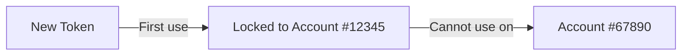

## What is an API Token?

An API token is a secure key that authenticates your MT4/MT5 Expert Advisor with InnovaTrading. Think of it as a password specifically for your trading terminal.

**Key features:**
- Each token is **unique** and can only be used by one MT4/MT5 account
- Tokens **auto-lock** to the first account that uses them
- You can have **multiple tokens** for multiple accounts
- Tokens can be **revoked** at any time

---

## Generate a New Token

<Steps>
  <Step title="Go to Connections">
    Navigate to [innova-trading.com/dashboard/connect](https://innova-trading.com/dashboard/connect)
  </Step>

  <Step title="Click New Connection">
    Click the **+ New Connection** button in the top-right
  </Step>

  <Step title="Name Your Token (Optional)">
    Enter a descriptive name like:
    - "ICMarkets Demo"
    - "Pepperstone Live"
    - "VPS Account"

    This helps you identify which token is which later.
  </Step>

  <Step title="Generate">
    Click **Generate Token**
  </Step>

  <Step title="Copy Immediately!">
    <Warning>
      The token is only shown **ONCE**. Copy it immediately and store it securely.
    </Warning>

    Click the copy button to copy to clipboard.
  </Step>
</Steps>

<Frame caption="Token generation flow">
  
</Frame>

---

## Token States

Your tokens can be in different states:

| State | Description | Icon |
|-------|-------------|------|
| **Pending** | Token created but not yet used by any EA | 🔑 Yellow |
| **Connected** | Token is linked to an account and EA is online | ▶️ Green |
| **Offline** | Token is linked but EA is currently not running | ▶️ Gray |
| **Revoked** | Token has been deleted and can no longer be used | 🗑️ Red |

---

## Token Locking

When you first use a token in your EA, it **automatically locks** to that specific MT4/MT5 account:

**Why locking?**
- Prevents token theft - if someone steals your token, they can't use it on a different account
- Ensures data integrity - each account's data stays separate
- Security - compromised tokens have limited blast radius

<Info>
  If you need to use a token with a different account, you must **disconnect** the current account first, or generate a new token.
</Info>

---

## Disconnect an Account

If you want to reuse a token with a different account:

<Steps>
  <Step title="Go to Connections">
    Navigate to [innova-trading.com/dashboard/connect](https://innova-trading.com/dashboard/connect)
  </Step>

  <Step title="Find Your Account">
    Locate the connected account you want to disconnect
  </Step>

  <Step title="Click Disconnect">
    Click the unlink icon (🔗) next to the account
  </Step>

  <Step title="Choose History Option">
    - **Keep history**: Your trade history remains in the Audit section
    - **Delete all**: Permanently removes all data (cannot be undone!)
  </Step>

  <Step title="Confirm">
    Click **Disconnect** to confirm
  </Step>
</Steps>

After disconnecting, the token becomes "Pending" again and can be used with a new account.

---

## Revoke a Token

If you suspect a token has been compromised, or you simply don't need it anymore:

<Steps>
  <Step title="Go to Connections">
    Navigate to [innova-trading.com/dashboard/connect](https://innova-trading.com/dashboard/connect)
  </Step>

  <Step title="Find the Token">
    Locate the token you want to revoke
  </Step>

  <Step title="Click Delete">
    Click the trash icon (🗑️)
  </Step>

  <Step title="Confirm">
    Confirm the deletion
  </Step>
</Steps>

<Warning>
  Revoking a token is **immediate and permanent**. The EA will stop working instantly and show Error 401.
</Warning>

---

## Best Practices

<AccordionGroup>
  <Accordion title="Use descriptive names">
    Name your tokens clearly so you know which account they belong to:
    - ✅ "ICMarkets Live #12345"
    - ✅ "Demo Account - Testing"
    - ❌ "Token 1"
    - ❌ "asdfgh"
  </Accordion>

  <Accordion title="One token per account">
    Don't try to use the same token on multiple terminals for the same account. Generate separate tokens if needed.
  </Accordion>

  <Accordion title="Revoke unused tokens">
    If you're no longer using an account, revoke its token to keep your dashboard clean and secure.
  </Accordion>

  <Accordion title="Store tokens securely">
    Treat tokens like passwords:
    - Don't share them
    - Don't post them in forums or screenshots
    - Don't commit them to git repositories
  </Accordion>
</AccordionGroup>

---

## Token Expiration

Tokens expire **1 year** after creation. Before expiration:

1. You'll see a warning in your dashboard
2. Generate a new token
3. Update your EA with the new token
4. The old token stops working at expiration

<Tip>
  Set a calendar reminder for 11 months after creating important tokens so you don't lose connectivity.
</Tip>

---

## FAQ

<AccordionGroup>
  <Accordion title="I lost my token, what do I do?">
    Generate a new token. There's no way to recover a lost token (by design, for security).
  </Accordion>

  <Accordion title="Can I see my existing tokens?">
    No. For security, tokens are only shown once at creation. You can see which tokens exist and what accounts they're linked to, but not the token values themselves.
  </Accordion>

  <Accordion title="How many tokens can I have?">
    There's no hard limit. Create as many as you need for your accounts.
  </Accordion>

  <Accordion title="What happens if my token is compromised?">
    Immediately revoke it from your dashboard. The attacker won't be able to use it after revocation. Then generate a new token for your EA.
  </Accordion>
</AccordionGroup>

---

## Next Steps

<CardGroup cols={2}>
  <Card
    title="Install the EA"
    icon="download"
    href="/guides/install-ea"
  >
    Configure your EA with the token
  </Card>
  <Card
    title="Multi-Account"
    icon="users"
    href="/guides/multi-account"
  >
    Connect additional accounts
  </Card>
</CardGroup>
