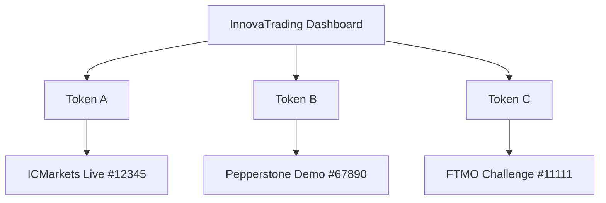

## Overview

InnovaTrading supports connecting **multiple trading accounts** simultaneously. This is perfect for:

- Managing **demo and live** accounts side by side
- Tracking accounts across **different brokers**
- Running **multiple strategies** on separate accounts
- Professional traders with **prop firm accounts**

---

## How It Works

Each account needs its own API token:



All accounts appear in your unified dashboard, but data is kept separate.

---

## Setup Multiple Accounts

<Steps>
  <Step title="Generate Token for First Account">
    Go to [Connections](https://innova-trading.com/dashboard/connect) and create a token.

    Name it descriptively: "ICMarkets Live"
  </Step>

  <Step title="Install EA on First Terminal">
    Follow the [installation guide](/guides/install-ea) with this token.

    Wait until the account shows as **Connected**.
  </Step>

  <Step title="Generate Token for Second Account">
    Click **+ New Connection** again to generate another token.

    Name it: "Pepperstone Demo"
  </Step>

  <Step title="Install EA on Second Terminal">
    On your second MT4/MT5 installation, attach the EA with the second token.
  </Step>

  <Step title="Repeat for Additional Accounts">
    Generate a new token for each account you want to connect.
  </Step>
</Steps>

<Info>
  Each token automatically locks to its account on first use. You cannot reuse a token for a different account.
</Info>

---

## Dashboard View

Once connected, all accounts appear in your dashboard:

```
┌────────────────────────────────────────────────────────────┐
│ Connections                                                 │
├────────────────────────────────────────────────────────────┤
│ ▶ #12345 • ICMarkets-Live          [Connected]    2m ago   │
│ ▶ #67890 • Pepperstone-Demo        [Connected]    5m ago   │
│ ▶ #11111 • FTMO-Challenge          [Offline]      2h ago   │
│ 🔑 Token "New Account"              [Pending]              │
└────────────────────────────────────────────────────────────┘
```

---

## Switching Between Accounts

On the InnovaTrading platform, you can switch between accounts to view:

- **InnovaCharts**: Uses data from any connected account
- **Dashboard**: Shows statistics per account
- **Audit**: Trade history per account
- **Analytics**: Performance metrics per account

<Tip>
  Use the account selector in the top navigation to switch between connected accounts.
</Tip>

---

## Same Broker, Multiple Accounts

You can connect multiple accounts from the **same broker**:

| Account | Token | Status |
|---------|-------|--------|
| ICMarkets #12345 (Live) | Token A | Connected |
| ICMarkets #67890 (Demo) | Token B | Connected |
| ICMarkets #11111 (Contest) | Token C | Pending |

Just make sure each account has its own unique token.

---

## Same Terminal, Multiple EAs

<Warning>
  You can only attach **one EA per chart** in MetaTrader. However, you can:
</Warning>

**Option 1: Multiple Charts**
- Open multiple charts in the same terminal
- Attach a different EA instance to each chart
- Each with a different token

**Option 2: Multiple Terminal Installations**
- Install MT4/MT5 multiple times in different folders
- Run each installation simultaneously
- More reliable for production use

**Recommendation:** For serious multi-account management, use multiple terminal installations or a VPS for each account.

---

## VPS Multi-Account

For 24/7 monitoring of multiple accounts:

<Steps>
  <Step title="Set Up VPS">
    Get a VPS (Windows Server recommended) with sufficient resources:
    - 1 GB RAM per MT4/MT5 instance
    - 20 GB storage minimum
  </Step>

  <Step title="Install Multiple Terminals">
    Install MT4/MT5 in separate folders:
    ```
    C:\MT5_ICMarkets\
    C:\MT5_Pepperstone\
    C:\MT4_FTMO\
    ```
  </Step>

  <Step title="Generate Tokens">
    Create a unique token for each account
  </Step>

  <Step title="Configure Each Terminal">
    Follow the [EA installation guide](/guides/install-ea) for each
  </Step>

  <Step title="Set Auto-Start">
    Configure Windows Task Scheduler to start each terminal on system boot
  </Step>
</Steps>

---

## Aggregate Analytics

With multiple accounts connected, you get:

- **Combined equity curve** across all accounts
- **Per-account** breakdown of performance
- **Cross-account** trade comparison
- **Unified** trade history search

<Frame caption="Multi-account analytics view">
  
</Frame>

---

## Limits

| Feature | Limit |
|---------|-------|
| Tokens per user | Unlimited |
| Connected accounts | Unlimited |
| Concurrent online accounts | Unlimited |
| Data retention | Based on your plan |

<Note>
  Enterprise plans include additional features like team account sharing and consolidated reporting.
</Note>

---

## Troubleshooting

<AccordionGroup>
  <Accordion title="Account appears multiple times">
    **Cause:** Same token used on multiple terminals for the same account.

    **Fix:** Use a single token per account. If you need redundancy, generate multiple tokens.
  </Accordion>

  <Accordion title="One account connected, others pending">
    **Cause:** Token not yet used, or EA not running.

    **Fix:** Verify the EA is attached and running on each terminal. Check the Experts tab for errors.
  </Accordion>

  <Accordion title="Data from wrong account showing">
    **Cause:** Account selector not switched.

    **Fix:** Use the account selector dropdown to switch to the correct account.
  </Accordion>
</AccordionGroup>

---

## Next Steps

<CardGroup cols={2}>
  <Card
    title="Token Management"
    icon="key"
    href="/guides/create-token"
  >
    Learn advanced token features
  </Card>
  <Card
    title="Troubleshooting"
    icon="wrench"
    href="/troubleshooting#ea-errors"
  >
    Fix connection issues
  </Card>
</CardGroup>
